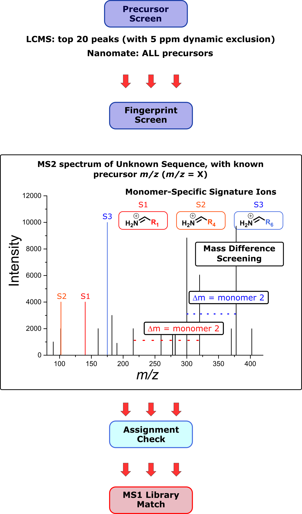
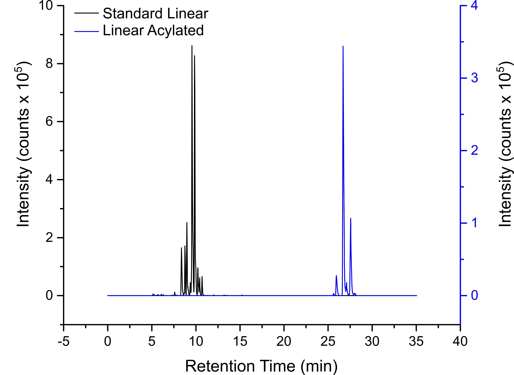
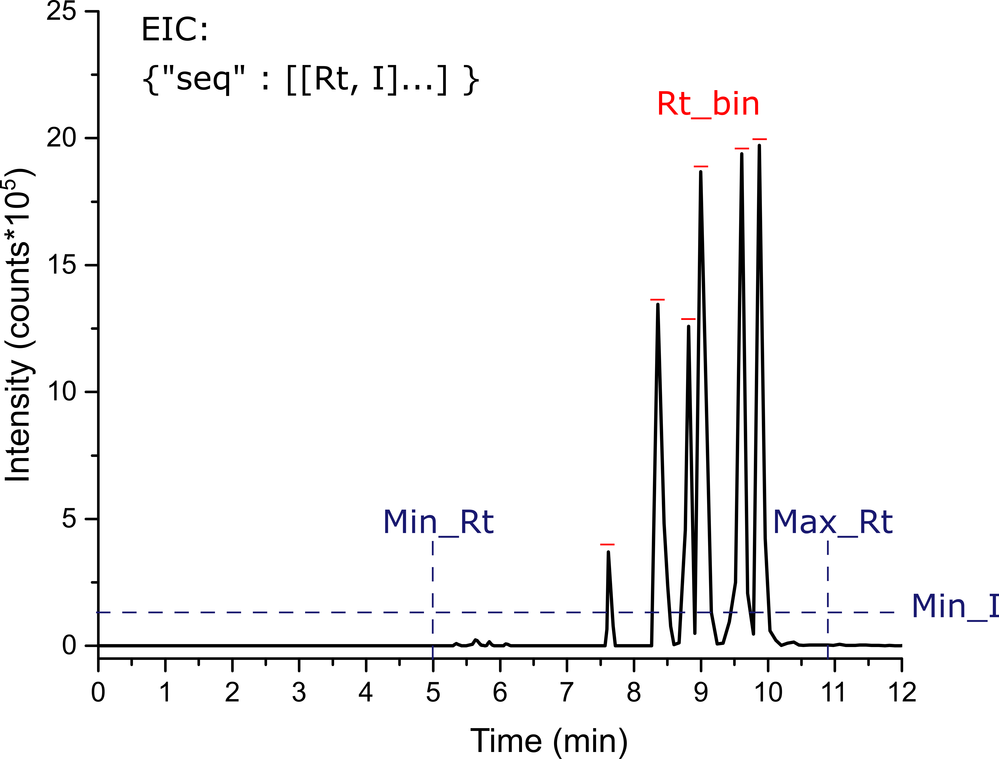
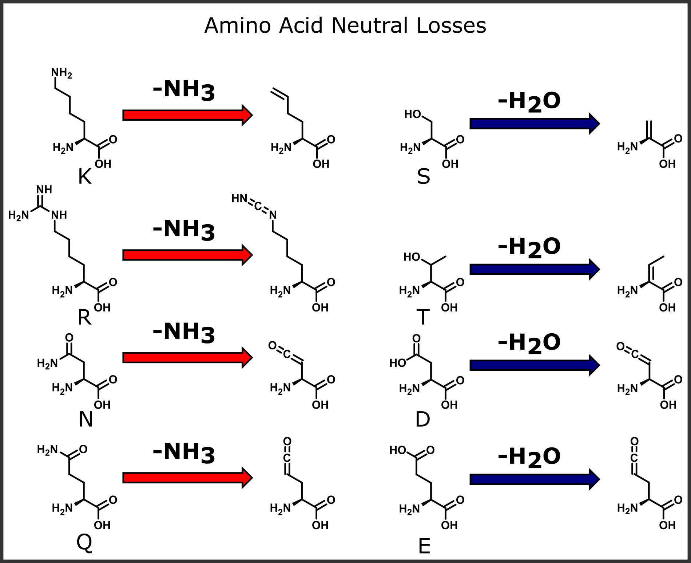

# PolymerMassSpec

PolymerMassSpec is a python project designed to enable _de novo_ sequencing and
analysis of highly heterogeneous mixtures of small to medium-sized linear
oligomers from mass spectrometry data.

__Note__: proper use of this package requires a decent working knowledge of
both the chemistry and analytical methods used to obtain results. It is
__not__ a magic bullet that can solve all of your complex polymer soup problems!
Please ensure that all results are validated wherever possible, and that
the raw mass spectrometry data input to the package is of good quality. 

For advice on parameters to use for data extraction, see 
polymersoup/StandardInstrumentParameters/InstrumentStandards.py

## Dependencies

- Python (version 3.6.0 or later)

This package was written in Python 3.7, but should be compatible with version
3.6 or later.

- mzML

Mass spectrometry data must be in .mzML file format. mzML files can be
generated from a variety of vendors using Proteowizard MS Convert, which is
freely available here: http://proteowizard.sourceforge.net/download.html

- mzmlripper

mzML files must be converted to JSON using Graham Keenan's mzmlripper,
instructions and documentation for which can be found here:

http://datalore.chem.gla.ac.uk/Origins/mzmlripper.git

## Installation

Repo can be cloned from:

```
https://gitlab.com/croningroup/origins/polymermassspec.git

```

## Run

__1__ Convert raw data files to mzmlripper JSON files

__2__ Ensure _Input Parameters_ JSON file is filled in with correct run
parameters (see __"Run Parameters"__ section)

__3__ Run executable script:

Experiments are run from the executable, which can be found here:

_polymersoup/executable.py_

To run the script:

```
python -m polymersoup.executable input_parameters_file.json

```

## Sequencing Workflows 

Currently there are two sequencing workflows available in PolymerSoup: 

1. The "exhaustive screening" workflow

2. The "mass difference screening" workflow 

Exhaustive screening should be used for products with well characterised fragmentation pathways and a detailed 
polymer-specific config file. Mass difference screening should be used for products with less well characterised fragmentation pathways and / or less extensive polymer config files. See __"Polymer Config"__ section below for requirements for building a full polymer config file. 

Both of these workflows can be run from the run parameters file (see __Run Parameters__ below). 

Below are brief summaries of each workflow: 

### Exhaustive Screening Workflow 


#### Step 1: 

Raw data is converted using GAK's mzml ripper. 

#### Step 2: 

Extracted data is pre-filtered (see "pre_filters" in __Run Parameters__ section, below)

#### Step 3: 

An MS1 in silico library is generated for all potential precursor __compositions__. Pre-filtered data is then screened for these precursors 

#### Step 4: 

Precursors exceeding a user-defined intensity / abundance threshold within experimental constrains (e.g. retention time - see "data_exctraction" in __Run Parameters__ section) are carried forward for full in silico fragmentation at MS2 for every __sequence__ matching precursor compositions 

#### Step 5: 

MS2 spectra are screened for the full MS1 precursor and MS2 product ion in silico library. MS2 product ions associated with precursors are returned 

#### Step 6: 

Confidence assignments are made from confirmed precursor-product ion associations, with the option to use unique fragments to distinguish between isomeric sequences (see "postprocess_parameters" in __Run Parameters__ section).

### Mass Difference Workflow 



#### Step 1: 

Most intense / abundant precursors are selected from the MS1 base peak chromatogram (see "data_extraction" in __Run_Parameters__ section). For data with pre-measurement chromatography (i.e. LCMS/MS), we advise using only the most intense MS1 precursors for screening. For data without chromatrography, there should be few enough spectra that __all__ precursors can be screened. 

#### Step 2: 

Screen MS2 spectra of precursors that have passed precursor screen in __Step 1__. Monomers are identified by mass shifts between MS2 product ion peaks and / or specific, single signature ions. 

#### Step 3: 

Check the assignment quality of MS2 spectra assigned to two or more monomer mass ladders and / or signature ions. This is done by observing the __relative__ intensity of the most intense peak in each spectrum that has been assigned.  

The assignment % can be set by the "min_ms2_peak_abundance" parameter that is also used in the exhaustive screening workflow (see "data_extraction" in __Run Parameters__ section). 


#### Step 4: 

For MS2 spectra that have passed the assignment check in __Step 3__, build an MS1 in silico library to attempt to identify precursors. NOTE: this may not work well unless MS1 neutral losses, aggregates, solvent clusters and adducts are well known for your samples. If it doesn't work at first, have a think about what salts you might have there! 

## Run Parameters

All run parameters are passed in through a single JSON file.

Input parameters are divided into three sections:

### General Parameters: 

* __"screening_method"__: 

  * Description: determines workflow to be used for sequencing. 

  * Options: "exhaustive" for a full sequencing workflow using an MS1-MS2 in silico library. Use this option for polymers with well characterised fragmentation pathways and a detailed polymer config file (see Polymer Config section, below). "mass_difference" for polymers with poor quality polymer config file and / or unknown fragmentation pathways. 

  *  Recommended: "exhaustive" for depsipeptides, "mass_difference" for everything else 

* __"perform_silico"__: 

  * Description: specifies whether to generate a new in silico library or if one already exists for the current data set. 

  * Options: true or false 

  * Recommended: true if starting a new run from scratch; false if restarting a partially complete run that had already reached MS2 screening stage 

* __"data_extraction"__: 

  * Description: specifies whether to perform data extraction (i.e. MS1 EICs and confirmed MS2 fragments for target sequences) or if these have already been extracted for current data set 
  
  * Recommended: true if starting a run from scratch; false if restarting a previous run that had already completed MS1 and MS2 data extraction steps 

* __"postprocess"__: 

  * Description: specifies whether to perform postprocessing steps (i.e. sequence confidence assignments, output of data summary csv files) or whether this has already been done

  * Recommended: true, as this is the final step in the exhaustive workflow. Set to false if for some reason you don't want to assign confidence values to sequence hits, or if you have your own way of assigning confidence from extracted data (NOTE: if you do have a better way of assigning confidence scores, please let either David Doran or Emma Clarke know)


### 1. silico parameters:

#### __General silico parameters__:


* __"mode"__:

  * Description: this parameter specifies whether mass spec acquisition is in positive or negative mode

  * Options: either _"pos"_ or _"neg"_ for negative and positive mode, respectively


#### __MS1 silico parameters__:


  * __"monomers"__:

    * Description: list of monomers used in your reaction(s). These __MUST__ match monomer one letter codes supplied in polymer-specific config file (see __"Polymer Config File"__ section, below)

    * Options: any combination of monomer one letter codes supplied in
    polymer-specific config file

* __"max_length"__:

  * Description: maximum length of target sequence(s)

  * Options: any integer

  * Recommendations: we do not recommend attempting to sequence product pools with more than 2 million potential sequences at this stage. Anything up to and including this should be doable (if not, please let us know!!!). 
  
  Here is a handy graph to let you estimate the linear sequence space of you will be screening: 

   "Combinatorial Explosion Sequence Space")


* __"min_length"__:

  * Description: specifies minimum length of target sequence(s)

  * Options: integer

  * Recommended: 1 for most experiments

* __"ms1_adducts"__:

  * Description: list of adducts to screen for in MS1 data. Adducts are supplied as lists of strings, each adduct string __MUST__ be present in GlobalChemicalConstants.py. If you require adducts that are not in this file, please let us know.

  * Options: any combination of adducts in the GlobalChemicalConstants file that match overall charge state of mode

  * Recommended: ["H"] for most samples in positive mode

* __"min_z"__:

  * Description: specifies minimum __absolute__ charge state for MS1 precursor ions.

  * Options: integer or null. If null, minimum charge will be for a sequence will be set to the default minimum charge of the sequence + adducts. 

  * Recommended: 1 for standard samples. __NOTE__: if you have any monomers that are _intrinsically_ charged, do __NOT__ account for this by increasing "min_z". Rather, update the polymer-specific config file
  and this will be factored in to any runs with charged monomers (see __"Polymer Config File"__ section, below)

* __"max_z"__:

  * Description: specifies maximum __absolute__ charge state for MS1 precursor ions.

  * Options: integer or null. If null, the maximum charge will be defined by adducts present.  

* __"losses"__:

  * Description: specifies whether to include side chain-specific neutral loss products for MS1 precursor ions. These are common for ESI sources for certain monomers. 

  * Options: true or false

  * Recommended: true, unless you are certain from previous observations that these loss products will not be observed. __NOTE__: this can drastically affect the results, __be careful__

* __"max_neutral_losses"__:

  * Description: specifies whether to place an upper limit on the number of side chain-specific neutral loss products to include for any given MS1 precursor

  * Options: integer or null

  * Recommended: null, unless you have a problem with false positives due to screening for too many precursor ions (this may be an issue for sequence pools with a large excess of loss product-prone side chains)


* __"universal_rxn"__:

  * Description: this specifies whether all input monomers are universally cross-reactive. If this is the case, the code only needs to perform very simple operations to generate _in silico_ data. Otherwise, more complex (and therefore more _time consuming_) operations are required to generate _in silico_ data

  * Options: true (if you need to set this to false please speak to David Doran or Emma Clarke first - this has never been properly tested on monomers that are not universally cross-reactive) 

  * Recommended: true if this true, otherwise you __MUST__ make sure that monomer reactivity classes are defined correctly in the polymer-specific config file and speak to David Doran or Emma Clarke before the first run. 

* __"universal_sidechain_modifications"__:

  * Description: specifies whether any covalent sidechain modifications are universal (i.e. to be added to every possible modifiable sidechain) or not. 

  * Options: true or false. If true, every target sidechain will be modified. If false, both modified and unmodified sidechains will be incorporated into in silico libraries

  * Recommended: true if you expect there to be no unmodified sidechains; false if you expect your products to contain a mixture of modified and unmodified sidechains

* __"universal_terminal_modifications"__:

  * Description: specifies whether any covalent terminal modifications are universal or not 

  * Options: true or false. If true, all sequences will contain modification(s) at target termini. If false, sequences will be screened for a mix of free and modified termini 

  * Recommended: true if you expect there to be no sequences with unmodified termini; false if you expect your products to be a mix of terminally modified and unmodified sequences

* __"terminal_monomer_tags"__: 

  * Description: list of monomers to add on to 0 and or -1 terminus 

  * Options: list or null for both "0" and "-1" terminus 

  * Recommended: only use if you expect ALL of your sequences to terminate in specific monomer(s)

* __"terminal_modifications"__:

  * Description: lists of non-monomer covalent modifications at 0 and / or -1 terminus

  * Options: list or null for both 0 and -1 terminus. NOTE: modifications must be given as lists of three-letter codes for covalent modifications. These must be in the MODIFICATIONS dict in the polymer-specific config file

  * Recommended: null if not expecting terminal modifications, otherwise list of three letter codes for each modified terminus

* __"side_chain_modifications"__: 

  * Description: specifies which (if any) sidechains are to be covalent modified and with what covalent modifiers

  * Options: null/empty dict or dict with keys = monomer one letter codes and values = lists of modification three letter codes for monomer sidechains. Example: {"K": ["Ole", "Pal"]} will target monomer K (lysine, polymer=Depsipeptide) with covalent modifications oleic acid and palmitic acid

* __"cyclic_sequences"__: 

  * Description: specifies whether to include potentially cyclic sequences in in silico library 

  * Options: true or false 

  * Recommended: false unless spoken to David Doran or Emma Clarke 

* __"isobaric_targets"__:

  * Description: list of compositions used to constrain in silico library when screening for specific targets 

  * Options: null or list of sequence / composition strings 

  * Recommended: null for de novo sequencing, list of composition strings if you only want to look for sets of isomeric sequences matching these compositions 


#### __MS2 silico parameters__:

* __"fragment series"__:

  * Description: list of fragment series one letter codes

  * Options: any list of fragment one letter codes found in polymer-specific config file

  * Recommended: ["b", "y"] for peptides fragmented via CID, ["b", "y", "a"] for peptides fragmented via HCD

* __"ms2_adducts"__:

  * Description: list of adducts to add to MS2 fragments other than intrinsic adducts specified in polymer-specific config file

  * Options: any list of adducts found in GlobalChemicalConstants
 
  * Recommended: ["Na"] for standard experiments in positive mode

* __"ms2_losses"__:

  * Description: specifies whether to include side chain-specific neutral loss products for MS2 fragment ions

  * Options: true or false

  * Recommended: true

* __"ms2_max_neutral_losses"__:

  * Description: specify upper cap on number of side chain-specific neutral loss products to include for MS2 fragments

  * Options: null or integer

  * Recommended: null

* __"ms2_loss_products_adducts"__:

  * Description: specify whether to add any adducts on to MS2 neutral loss products

  * Options: null or list of any adducts found in GlobalChemicalConstants.py

  * Recommended: null. Only use in fringe cases where you expect specific adducts to be associated with neutral loss fragments 

* __"add_signatures"__:

  * Description: specify whether to add monomer-specific signature ions for MS2 fragments

  * Options: true or false

  * Recommended: true

* __"signatures"__:

  * Description: if monomer MS2 signatures are to be added, this specifies any particular subsets of signatures that are to be added. If "add_signatures"==true and null is supplied, ALL signature types will be added

  * Options: null or list of signature types specified in polymer-specific config file

  * Recommended: null

* __"min_z"__:

  * Description: specifies minimum charge of MS2 ions

  * Options: integer

  * Recommended: 1

* __"max_z"__:

  * Description: specifies maximum charge of MS2 ions

  * Options: integer

  * Recommended: 1 for standard CID of small to medium-sized polymers, with the exception of polymers with excess of intrinsically charged monomers and / or large multi- metal centre transition metal complexes


## 2. extractor_parameters:

### __general extractor parameters__:


* __"error"__:

  * Description: specifies error tolerance threshold for matching target ions to ions observed in mass spectra. This can be supplied as an absolute value (mu) or relative error (i.e. ppm)

  * Options: float

  * Recommended: 0.01 mu (absolute) for Bruker or Orbi data. For relative error, 10-20 ppm for Bruker and 5 ppm for Orbitrap data. 

* __"err_abs"__:

  * Description: specifies whether error units are in absolute mass units or ppm

  * Options: true or false

  * Recommended: true

* __"min_ms2_peak_abundance"__:

  * Description: specifies minimum relative abundance of most intense matching MS2 peak for a target sequence in observed MS2 spectra, expressed as a % of the most intense peak observed in the spectrum

  * Options: float (range = 0 to 100)

  * Recommended: 90-100, possibly 80 for products with poorly characterised fragmentation pathways (e.g. branched sequences, non-peptidic polymers)

  Below is a figure to illustrate minimum MS2 peak abundance: 

  *MS2 product ion peaks assigned to peaks in an in silico library are highlighted in green abscissa (peaks 1,2,3). In spectrum a, the most intense peak has been assigned, so this spectrum is valid and will be used for screening and sequence confirmation. In spectrum b, the most intense peak (red) is unassigned, so this spectrum will __not__ be used for further screening and sequence assignment, depsite containing three product ions that are potential matches in the library*


* __"pre_run_filter"__:

  * Description: specifies whether to filter spectra before beginning sequence screening. If true, spectra will be filtered through pre_screen_filters and sequences will be screened against truncated data set of spectra that pass these filters.

  * Options: true or false

  * Recommended: true

* __"min_MS1_total_intensity"__:

   * Description: specifies minimum TOTAL INTENSITY (sum of intensity of all ions) for MS1 spectra when searching for precursors. Spectra with total intensities below this value will be passed over during screening 

   * Options: null or float 

   * Recommended: null, as spectra will usually be pre-filtered (see "pre_screen_filters" section below)

* __"min_MS2_total_intensity"__:
  
  * Description: specifies minimum TOTAL INTENSITY (sum of intensity of all ions) for MS2 spectra when searching for product ions. Spectra with total intensities below this intensity will be passed over during screening 

  * Options: null or float 

  * Recommended: null, as spectra will usually be pre-filtered (see "pre_screen_filters" section below)

* __"min_MS1_max_intensity"__:

  * Description: specifies minimum base peak intensity for MS1 spectra when searching for precursor ions. Spectra with base peak intensities below this value will be passed over when screening for precursor ions. 

  * Options: null or float 

  * Recommended: null, as spectra will usually be pre-filtered (see "pre_screen_filters" section below)

* __"min_MS2_max_intensity"__:

  * Description: specifies minimum dominant ion intensity for MS2 spectra when searching for product ions. Spectra with dominant ion intensities below this value will be passed over when screening for product ions. 

  * Options: null or float 

  * Recommended: null, as spectra will usually be pre-filtered (see "pre_screen_filters" section below)

* __"filter"__:

  * Description: specifies whether to filter MS2 spectra by precursor intensity in bpc for mass difference screens 

  * Options: true or false 

  * Recommended: true. DO NOT CHANGE THIS. speak to David Doran or Emma Clarke if you want to play around with the mass difference screen 

* __"N_bpc_peaks"__:

  * Description: specifies number of nth most intense MS1 ions in each MS1 spectrum to use for generation of base peak chromatogram data in mass_difference_screen 

  * Options: integer (minimum =1)

  * Recommended: 1

* __"massdiff_bpc_filter"__:

  * Descripton: *to be completed* 

  * Options: DO NOT TOUCH 

  * Recommended: DO NOT TOUCH 

* __"abs_precursor_exclusion"__:

  * Description: *to be completed* 

  * Options: DO NOT TOUCH

  * Recommended: DO NOT TOUCH 

### __pre_screen_filters__:

These parameters are used to pre-filter spectra. Only spectra that make it through these pre-filters will be used for data extraction and screening in sequencing workflows 

* __"min_rt"__:

  * Description: specifies minumum retention time of raw spectra. Any spectra with retention time lower than this will be discarded from consideration

  * Options: float 

  * Recommneded: 0 unless you know your chromatography well enough. NOTE: retention time units are currently in minutes for Orbitrap data but seconds for Bruker data. CHECK THIS!! 

* __"max_rt"__:

  * Description: specifies maximum retention time of raw spectra. Any spectra with retention time higher than this will be discarded from consideration

  * Options: float

  * Recommended: run time (in minutes for Orbi, seconds for Bruker) of your method unless you know exactly what you are doing with this

  Below is an example of retention time ranges and how they can help rule out (or confirm) the presence of specific sequences: 

  *Combined Extracted Ion Chromatograms (EICs) for N-terminally acylated (blue) and non-acylated (black) linear depsipeptides analysed via LCMS/MS. Summation of MS1 precursor abundances over time is shown for both sets of products. Sequences were synthesized via uncontrolled polymerisation of L-Valine, L-Asparagine and glycolic acid +/- oleic acid*


* __"essential_signatures"__:

  * Description: list of monomers that MUST have signatures present in MS2 spectra. Any MS2 spectra without these signatures will be discarded.

  * Options: null or list of monomer one-letter codes. These monomers MUST have signature ions in polymer-specific config file.

  * Recommended: null, unless you know for certain every sequence has these monomers AND  that these monomer signatures will always show up in MS2 spectra.

* __"signature_types"__:

  * Description: specifies list of signature codes to include in essential signatures. These MUST correspond to signature types in polymer-specific config file

  * Options: any list of signature type found in polymer-specific config file

  * Recommended: ["Im"] for peptides using depsipeptide config file, as this signature class represents immonium ions. NOTE: if signature_types is set to null, ALL potential signatures from "essential_signatures" input will be screened. 

* __"signature_ms_level"__:

  * Description: specifies which MS level signatures will be present

  * Options integer

  * Recommended: 2, as presently we only have data for MS2 signatures

* __"massdiff_bins"__:

  * Description: *to be completed*. RELEVANT ONLY TO mass_difference SCREEN. DO NOT USE 

  * Options: true or false

  * Recommended: *to be completed*

* __"ms2_precursors"__:

  * Description: list of precursor ions for matching to MS2 parents in observed MS2 spectra. Any MS2 spectra that do not have a parent matching one or more of these precursors will be discarded from consideration.

  * Options: null or list of floats

  * Recommended: null unless doing very targeted screening for specific small subset of products (which general screen should pick up anyway...)

* __"min_MS1_total_intensity"__:

  * Description: specifies minimum total intensity of MS1 spectra. Any MS1 spectra with total intensity lower than this will be discarded from consideration

  * Options: null or float

  * Recommended: null

* __"min_MS2_total_intensity"__:

  * Description: specifies minimum total intensity of MS2 spectra. Any MS2 spectra with total intensity lower than this will be discarded from consideration

  * Options: null or float

  * Recommended: null

* __"min_MS1_max_intensity"__:

 * Description: specifies minimum maximum intensity of MS1 spectra. Any MS1 spectra with maximum intensity lower than this will be discarded from consideration

  * Options: null or float

  * Recommended: 1E3 for Bruker data, 1E5 for Orbitrap data. 

* __"min_MS2_max_intensity"__:

  * Description: specifies minimum maximum intensity of MS2 spectra. Any MS2 spectra with maximum intensity lower than this will be discarded from consideration

  * Options: null or float

  * Recommended: null. There is an inbuilt intensity threshold in GAK's mzml ripper which should remove most noise. If your data is missing MS2 peaks, see David Doran or Emma Clarke.


## 3. postprocess parameters:


* __"exclude_frags"__:

  * Description: list of specific fragment ids to exclude from consideration in confidence assignments ONLY (will still be included in retention time assignment)

  * Options: null or any list of valid fragment ids

  * Recommended: null

* __"optional_core_frags"__:

  * Description: list of specific fragment ids to exclude from consideration in confidence assignments IF they are absent

  * Options null or any list of valid fragment ids

  * Recommended: ["b1"] for peptides in positive mode, as this particular MS2 fragment is notorious for not showing up in MS2 spectra of peptides

* __"core_linear_series"__:

  * Description: list of fragment series one letter codes for fragment series that should be used in confidence calculations. NOTE: it is assumed that each series in this list will receive an equal weighting in confidence calculation; if this is not suitable for your chemistry, please let us know!!!

  * Options: list of valid fragment one letter codes. NOTE: this MUST not inclue signatures

  * Recommended: ["b", "y"] for peptides in positive mode (["y"] for peptides in negative mode)

* __"excluded_fragments"__:

  * Description: list of specific fragment ids to exclude from confidence assignments AND retention time assignments

  * Options: null or any list of specific fragment ids

  * Recommended: null

* __"dominant_signature_cap"__:

  * Description: specifies an upper cap on confidence assignments for sequences that are expected to have abundant monomer-specific MS2 signature(s) but have one or more of these missing

  * Options: float (range = 0 to 100)

  * Recommended: 70 for peptides containing dominant signature ions (see "Depsipeptide" config file). For other polymer classes there is currently no recommended value. 

* __"essential_fragments"__:

  * Description: specifies specific fragment ids that MUST be present for a sequence to be assigned with confidence

  * Options: null or list of specific valid fragment ids
  
  * Recommended: null

* __"subsequence_weight"__:

  * Description: specifies weighting to place on continuous fragment coverage in calculating overall confidence of a sequence assignment. This is supplied as a decimal fraction.

  * Options: float (range = 0 to 1) or list of floats

  * Recommended: we are still trying to work this out. Probably between 0.25 and 0.5

  __NOTE__: changing subsequence weight can drastically affect the results of your confidence assignments. For this reason, we advise comparing data over a range of subsequence weights and validating this with standards whenever possible. Below is an example of how subsequence weight can affect results of confidence assignments, using a theoretical example of two isomeric sequences: 

 *Fragments confirmed for two isomeric sequences, FSGNQVGS and SFGNQGVS, are highlighted (red and blue for b, y fragments respectively). Both sequences have the same number of theoretical fragments and the same number of confirmed fragments; and should therefore have the same confirmed fragment ratio (i.e. % identified fragments). However, they differ in their __mean continuous fragment coverage__, enabling FSGNQVGS to be assigned with higher confidence at subsequence weights > 0 *

* __"min_rt"__:

  * Description: mininimum retention time to assign to confirmed sequences

  * Options: null or float

  * Recommended: null. NOTE: units of retention time are in minutes for Orbitrap data and seconds for Bruker 

* __"max_rt"__:

  * Description: maximum retention time to assign confirmed sequences. NOTE: units of retention time are in minutes for Orbitrap data and seconds for Bruker 

  * Options: null or float

  * Recommended: null

* __"Rt_bin"__:

  * Description: specifies minimum separation of MS1 peaks in extracted ion chromatograms (units = minutes)

  * Options: float

  * Recommended: 0.25 for LC-MS, 0 without chromatography

  *An example MS1 EIC is shown with multiple peaks. Retention time range (set by min, max rt) and minimum gap between neighbouring peaks (Rt_bin) is shown*
* __"backup_Rt_bin"__:

  * Description: specifies a back-up retention time bin if peaks cannot be assigned with Rt_bin. This may be useful in cases where particular sequence subsets do not separate well using chosen chromatography method (which happens sometimes for complex mixtures)

  * Options: float (should be lower than Rt_bin)

  * Recommended: 0.1

* __"ms2_Rt_bin"__:

  * Description: specifies maximum discrepancy between retention time of unique MS2 fragment and MS1 precursor

  * Options: float

  * Recommended: 0.5 (this may be too generous)

* __"ms2_Rt_flexible"__:

  * Description: specifies whether to allow for the possibility of a mismatch between observed MS2 retention time and MS1 precursor within specified ms2_Rt_bin. If true, ms2_Rt_bin tolerance will be widened until a retention time can be assigned.

  * Options: true or false

  * Recommended: we need to test this urgently

* __"min_viable_confidence"__:

  * Description: specifies minimum confidence score for sequences to be assigned final retention time and intensity values. Sequences with scores lower than this will not be processed for retention time and / or intensities

  * Options: float

  * Recommended: 55-60

* __"min_relative_intensity"__:

  * Description: specifies minimum relative intensity (as % intensity of most intense peak) in EICs. Any peaks with relative intensities lower than this will be discarded, which may lead to less abundant sequences not being assigned.

  * Options: null or float (range = 0 to 100)

  * Recommended: null, unless you are deliberately attempting to assign retention time of very low confidence sequences (which probably won't work anyway..)


## 4. directories:


* __"ripper_folder"__:

  * Description: specifies location of folder containing mzml ripper JSON files

  * Options: string file path to folder

  * Recommended:

* __"output_folder"__:

  * Description: specifies location of output folder, where output data will be saved

  * Options: full string file path to output folder

  * Recommended: scapa data folder (obviously)

* __"polymer_type"__: 

  * Description: specifies which polymer-specific config file to use. ALL polymer config 
files must be kept in polymersoup/insilico/Config_files subfolder. 

  * Recommended: "Depsipeptide" for peptides and / or depsipeptides (obviously). 
"Polyimine" for polyimines; NOTE: polyimine config file is still a work in progress - 
use with caution! 


# __"Polymer Config File"__:

## SECTION 1: GENERAL MS1 AND CHEMISTRY RULES:

This section is used for general physicochemical properties relevant to building in silico libraries for chosen polymer class. 

__"MONOMERS"__:

- Description: dictionary of monomer one letter codes, along with associated neutral monoisotopic masses and reactivity classes (functional groups). This dictionary should specify the neutral monoisotopic mass for each monomer, its reactive functional groups, and the number of each reactive functional group. This information is essential to ensure that all theoretical sequences generated are chemically feasible.

- Format:  {'X': [mass, [[rxn_class1, n], [rxn_class2, y]]}
where X = monomer one letter code; mass = neutral monoisotopic mass; rxn_class1 and rxn_class2 = reactivity classes (functional groups - e.g. amine, aldehyde); n = number of rxn_class1 functional groups; y = number of rxn_class2 functional groups.

__"MASS_DIFF"__:

- Description: the mass difference when adding an additional monomer on to a polymer chain.

- Format: float or string

- Options: either float equal to neutral monoisotopic mass of mass difference OR string representing a float. If string, this must be defined in FUNCTIONAL_GROUPS dict in GlobalChemicalConstants.py 

__"ELONGATION"__:

- Description: the number of additional monomer units typically added when elongating a polymer.

- Format: integer (minimum value = 1)

- Options: This will typically be 1 for most polymers. 

__"REACTIVITY_CLASSES"__:

- Description: dictionary of reactivity classes with associated compatible classes and monomers.

- Format: {'classA' : [['classX', 'classY'], ['A', 'B']}
where classA = reaction class, classX and classY = classes that are cross-reactive with classA, and A and B are monomers within reaction class classA.

__"SYMMETRY"__:

- Description: bool to define whether polymer is identical at both ends.

- Options: true or false

- Recommended: Set to false for polymers with different termini (e.g. N- and C- termini for peptides), true for polymers with identical functional groups at both termini in linear chains.

__"CHAIN_TERMINATORS"__:

- Description: list of monomers that terminate chain elongation.

- Options: null unless you are certain a certain monomer will stop elongation of the chain in your reactions.

__"LOSS_PRODUCTS"__:

- Description: dictionary of monomer one letter codes and associated side chain neutral loss products, i.e. masses that can be lost from the monomer side chain.

- Format: {"x": [n,...],...} where 'x' = monomer one letter code and n = neutral monoisotopic mass of neutral lost from monomer side chain (this can either be a float or a string representing a float,defined in FUNCTIONAL_GROUPS in GlobalChemicalConstants.py)

An example of side chain neutral losses is shown below. Usually neutral loss fragments can be predicted based on the free functional groups present in side chains: 

*Example Neutral Loss Fragments. These can occur at both MS1 and MS2 for ESI-CID instruments. Side chains with a free amine (lysine, K; arginine, R) or carboxamide (asparagine, N; glutamine, Q) can lose neutral NH3. Side chains with a free hydroxyl (serine, S; threonine, T) or carboxyl (aspartic acid, D; glutamic acid, E) can lose H2O*

__"IONIZABLE_SIDECHAINS"__:

- Description: dictionary of monomers that can be ionised with extra adducts at the SIDE CHAIN, with associated adducts, minimum and maximum absolute charge states in both positive and negative mode.

- Format: {"X": {"pos": [adduct, a, b], "neg": [adduct, a, b]}}
where "X" = monomer one letter code, adduct = adduct string (must be found in either CATIONS OR ANIONS in GlobalChemicalConstants.py), a = min side chain charge, b = max side chain charge for ionized form.

An example of ionizable side chains is shown below for amino acids: 

*Histidine (H), Arginine (R) and Lysine (K)can be charged in positive mode, resulting in the addition of a proton adduct. Aspartic Acid (D) and Glutamic Acid (E) can deprotonate to become charged in negative mode*

__"INTRINSICALLY_CHARGED_MONOMERS"__:

- Description: dictionary of monomers that have an intrinsic charge (i.e. charged without addition of adducts), with associated lists of permissible adducts. NOTE: these are distinct from ionizable side chains, which are ionized via the addition or removal of exhangeable adducts.

- Format: we have not used intrinsically charged monomers, so currently no format exists for these. Please speak to David Doran or Emma Clarke if you need to sequence products with intrinsically charged monomers. 

## SECTION 2: MS2 FRAGMENTATION

This section should contain all the information required to construct a basic MS2 fragment series for linear polymers. Each fragment type is defined as a key in the FRAG_SERIES dict. Typically, fragment keys are one letter codes used to denote fragments - e.g. the standard 'b' and 'y' fragment series for peptides.
- When building fragment series, the fragment generator will use the following convention: f'{frag}{n}'
frag = fragment one letter code, n = number of monomers in fragment (e.g. b1, b2, b3, y1, y2, y3 etc...).

Additional, monomer-specific signature ions can also be included in the polymer config file if appropriate for chosen polymer class.

### __"FRAG_SERIES"__:

- Description: dictionary of fragment series one letter codes and associated properties.

- Format: Each fragment series key = fragment one letter code, value = subdictionary containing all relevant fragment properties. See the "Depsipeptide.json" config file for an example of a detailed FRAG_SERIES dict for a well characterised polymer class. 
Parameters in FRAG_SERIES are listed below: 

__"terminus"__:

- Description: end in which fragmentation starts.

- Options: -1 (for end of the sequence) or 0 (for start of the sequence)

- Recommendation: for sequences with "SYMMETRY"=false (see above), ensure the terminus is correct. For sequences with "SYMMETRY"=true, this doesn't matter (set as 0 for a good default)

__"mass_diff"__:

- Description: the difference in __neutral monoisotopic mass__  between the fragment and corresponding __neutral__ subsequence. This may vary depending on whether cations or anions are being fragmented, therefore separate mass_diffs are specified for positive mode ('pos') and negative mode ('neg') mass spec. Example: the 'y3' fragment of peptide sequence 'AGVS' = the mass of __neutral__ GVS plus the mass of H, so "mass_diff" is set to "H" for "y" fragments. 

- Options: either float or a string representation of a float (if string, this must be defined in FUNCTIONAL_GROUPS dict in GlobalChemicalConstants.py)

__"fragmentation_unit"__: 

- Description: the minimum number of monomer units typically added and / or removed at a time when building a fragment series.

- Recommended: Default is ELONGATION_UNIT for both "pos" or "neg", but this depends on fragmentation pathway(s) for fragment series

__"start"__: 

- Description: specifies the position where the fragment series starts, relative to starting terminus 

- Options: integer (minimum =0). The fragment series will begin n monomers from starting terminus, where n = int value of "start" (example: 1 for peptide a fragments, which begin from fragment "a2")

__"end"__: 

- Description: specifies the position where the fragment series ends relative to end terminus 

- Options: integer (minimum=0). The fragment series will end n monomers from end terminus, where n = integer value of "end" (example: 1 for peptide b fragments, which end one monomer short of the full sequence length)

__"intrinsic_adducts"__: 

__ATTENTION__: each fragment series must have __either__ intrinsic adducts __or__ intrinsic charges, __NOT__ both!! If this is unclear, speak to David Doran or Emma Clarke  

For an example of the differences between fragment series with intrinsic adducts and intrinsic charges, see "b" and "y" fragment series in "Depsipeptide.json" config file. 

- Description: specifies adducts that are formed as default during fragmentation events for this series. This will usually be different in positive and negative mode. NOTE: intrinsic adducts are __exchangeable__ ions that can be swapped with other, non-intrinsic ions if required. The charge state of intrinsic adducts can therefore be exchanged for the charge state of non-intrinsic ions. This is unlike __"intrinsic_charges"__ (see below). 

- Format: {"pos": "A", "neg": "-A"} where "pos", "neg" = positive and negative mode for fragmentation of cations and anions, respectively. "A" = adduct in positive mode, "-A" = adduct in negative mode. 

- Options: a single fragment series cannot have this and intrinsic charges, but must have one of the two

__"intrinsic_charges"__: 

__ATTENTION__: each fragment series must have __either__ intrinsic adducts __or__ intrinsic charges, __NOT__ both!! If this is unclear, speak to David Doran or Emma Clarke  

For an example of the differences between fragment series with intrinsic adducts and intrinsic charges, see "b" and "y" fragment series in "Depsipeptide.json" config file. 

- Description: specifies __non-exchangeable__ ions formed as default during a fragmentation event (example: acylium ions in peptide b fragments). These ions __cannot__ be exchanged for other charged groups, and so adding non-intrinsic ions to intrinsically charged fragments __must__ affect their charge state (new charge state = sum of intrinsic charges and charge of new adducts). This is unlike __"intrinsic_adducts"__ (see above). 

- Format: {"pos": C, "neg": D} where "pos", "neg" = positive and negative mode for fragmentation of cations and anions, respectively. "C" (float) = intrinsic charge in positive mode; "D" (float) = intrinsic charge in negative mode. 

- Options: a single fragment series cannot have both this and intrinsic adducts, but must have one of the two

#### Exceptions: 

__NOTE__: for sequences with heterogeneous backbone links (e.g. depsipeptides, which are a mix of ester and amide backbone links), exceptions to any of the above parameters can occur depending on the type of bond being fragmented. 

If a fragment series has the key "exceptions", sytandard rules do not apply under certain circumstances. For an example of this, see "y" fragment series in "Depsipeptide.json" config file. If the fragmenting bond is an ester (not the standard amide, exceptions occur to intrinsic adducts, massdiff and intrinsic charges for y fragments). If you have any questions about this, or would like to add new exceptions for your polymer class please speak to David Doran or Emma Clarke.  


### __"MS2_SIGNATURE_IONS"__:

- Description: MS2 fragments which can be used as markers for monomers and / or small subsequences.

- Format: 
            {
                __"type"__: [
                    ["m", sig1, sig2...],
                    ...
                    ]
                ,
                ...
                __"dominant"__: ["m", "n"...]
            }

where: 

__"type"__ is a string representing signature ion type (e.g. "Im" for peptide immonium signatures), "m" is monomer one-letter code, sig1 and sig2 are signatre ion __m/z__ values (__NOT__ neutral masses). NOTE: there can be any number of signature ions listed for a signature type / monomer combination 

__"dominant"__ = list of monomers with signatures that should __ALWAYS__ be present in MS2 or MSn spectra if those monomers are present in a target sequence (example: ["F", "I",  "L", "P", "H", "Y"] for peptides, as these monomers are known to have predominant diagnostic immonium ion fragments)

### __"MODIFICATIONS"__: 

- Description: "MODIFICATIONS" dict contains potential covalent modifications, each assigned a unique three letter code. These modifications can target specific termini and / or side chains, and may have their own associated MS2-MSn signature fragments 

- Format: {
    "Mod": {
        "mass": mass, 
        "termini": [...],
        "side_chain_attachments": ["m", "n"...],
        "free_mod_fragments": {
            "pos": [free_mass],
            "neg": [free_mass]
        },
        "mass_diff": {
            "ms1": massdiff, 
            "ms2: massdiff
        },
        "universal_ms2_shift": true or false,
    },
    ...
}

where: 

"Mod" = three letter code for covalent modification 

mass = neutral monoisotopic mass of free covalent modifier 

"termini" = list of termini that can be modified by modifying group (options: [] or null, [0], [-1], [0, -1])

"side_chain_attachments": list of monomers that can be covalently modified by this modifying group at their side chains ("m" and "n" = monomer one letter codes)

"free_mod_fragments" = list of ion __m/z__ values corresponding to dissociated MS2 or MSn fragments of modifying group in positive mode ("pos") or negative mode ("neg")

"mass_diff": the __neutral__ monoisotopic mass gained or lost upon addition of the covalent modifying group (relative to mass, see first entry for this dict) to either MS1 precursors ("ms1") or MS2 product ions ("ms2"). NOTE: mass_diff will almost always be identical for ms1 and ms2, except in rare cases. Values of massdiff can either be floats or string representation of float (provided string is in FUNCTIONAL_GROUPS dict in GlobalChemicalConstants.py)

"universal_ms2_shift": specifies whether all covalently modified fragments exhibit are shifted in mass by modification or whether modifying group can dissociate from these fragments at MS2

# Global Chemical Constants 

The GlobalChemicalConstants.py file can be found in polymersoup/insilico/Constants. This file contains information relevant to common ions, functional groups and solvents useful in sequencing a wide variety of polymer classes. Any new adducts that are to be used for a polymer class should be added to this file first, with detailed comments. 

## Section 1: Common Non-Adduct Masses 

Global variables can be set here for common masses, (e.g. H, H2O, OH, NH3...)

Common neutral solvent molecules can also be added to the SOLVENTS dict 

NOTE: for handling of references to global constants passed in from input parameters and / or polymer-specific config files, string representations of these values should be stored in FG ("functional group") dict 

## Section 2: Adducts 

This section contains two dictionaries, CATIONS and ANIONS, for storing string representations of positive and negatively charged ions, respectively. 

- Format: 
          {
            "A": (mass, min_z, max_z),
            ...
          }
  where "A" = string representation of ion (e.g. "H" for proton adduct),
  mass (float) = __neutral__ monoisotopic mass of adduct, 
  min_z and max_z = minimum and maximum charge state of ion, respectively 