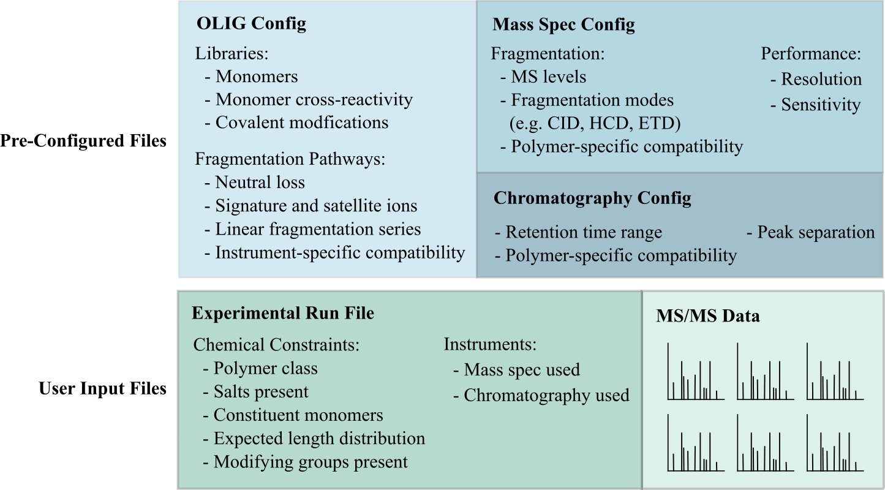

.. _Getting-Started:

###############
Getting Started
###############

.. _Overview:

Overview:
=========

OLIGOSS is a package for *de novo* sequencing of linear oligomers from
tandem mass spectrometry data.

**Note**: proper use of this package requires a good working knowledge of both
the chemistry and analytical methods used to obtain results. It is not a
magic bullet to solve all of your oligomer sequencing needs. Please ensure that
all raw mass spectrometry data input to the package is of good quality. All
results should be checked and validated wherever possible, especially if running
data from a new instrument and / or oligomer class.

Fragmentation and ionization of oligomers under MS/MS depends on many factors relating to
the specific oligomer class, mass spectrometry instrumentation and set-up, as
well as the analyte matrix. With this in mind, OLIGOSS allows for maximum
flexibility in defining experimental parameters.

OLIG
----
There are often many possible ionization and fragmentation pathways for a single
oligomer (or oligomer class). The relative predominance of these pathways will
depend on specific conditions, mainly instrumentation. The full

.. _Dependencies:

Dependencies
============

**Python (version 3.6.0 or later)**

OLIGOSS was written in Python 3.7.5, but should be compatible with version 3.6
or later.

**mzML**

* Mass spectrometry data must be in .mzML file format. mzML files can be
generated from a variety of vendors, including Proteowizard MS Convert, which is
freely available here: http://proteowizard.sourceforge.net/download.html
* mzMLs are automatically converted to JSON format using Graham Keenan's
mzmlripper, documentation for which can be found on `GitHub`_.

.._GitHub: https://github.com/croningp/mzmlripper.git

.. _System-Requirements:

System Requirments
==================

OLIGOSS was developed and tested on Ubuntu 19.10, and should therefore be
compatible with any Unix OS. As of version 0.0.3, OLIGOSS is incompabitible
with Windows. Windows compatibility will be introduced in a later version.
Luckily for Windows 10 users, the latest distributions of Ubuntu can be easily
installed and run from Windows 10. For instructions on 

.. _Installation:

Installation
=============

OLIGOSS is avaialable through The Python Package Index (`PyPI<https://pypi.org/project/oligoss/>`_).

Alternatively, the source code can be cloned directly from the OLIGOSS `GitHub repository<https://github.com/croningp/oligoss.git>`_.

.. _Running-OLIGOSS:

Running OLIGOSS
===============

To run an OLIGOSS sequencing workflow, run the following command::

    python3 -m oligoss -i input_params.json -r ripper_folder -o output_folder

**input_params.json = input parameters file**

    This should contain all relevant input parameters for executing an
    OLIGOSS sequencing workflow (see :ref:`Input-Parameters`).

**ripper_folder = data directory**.

    This argument can either be passed in via the command line directly (as above) or specified in the input parameters file using the data_folder parameter.
    This folder should contain input MS data in either mzML or ripper JSON format.

**out_dir = output directory**.

    This argument can either be passed in via the command line directly (as above) or specified in the input parameters file using the output_folder parameter.
    All output data will be dumped to this folder.

